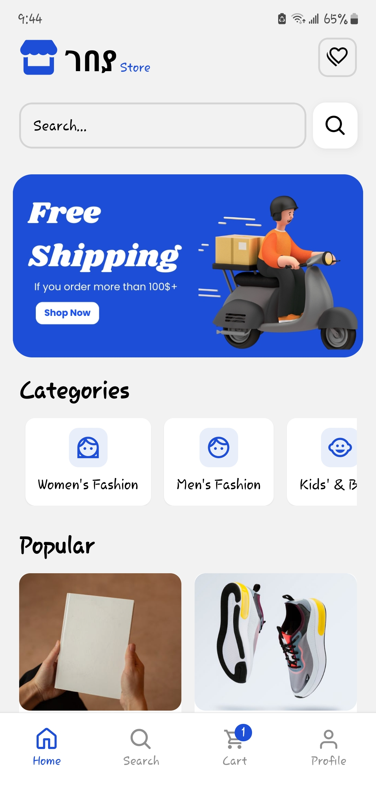
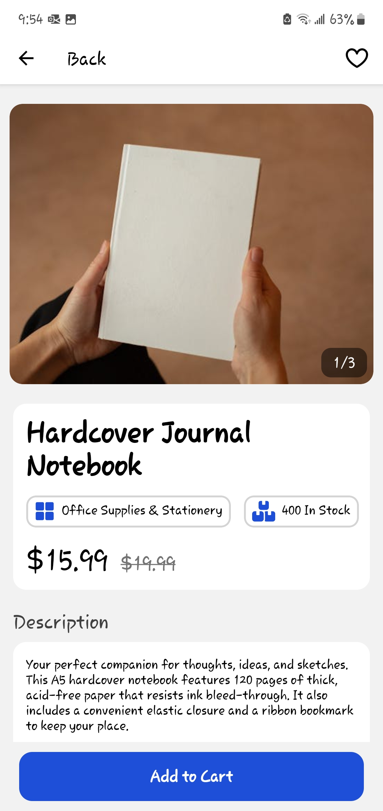
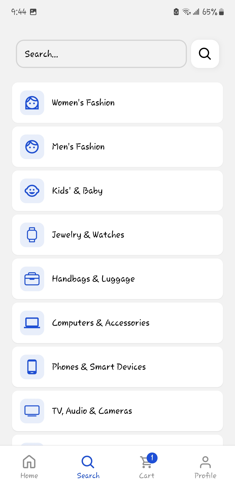
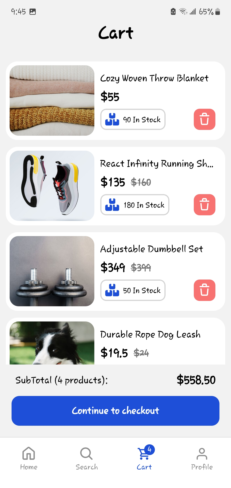
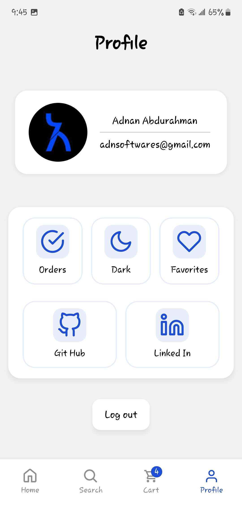

# ገበያ store 🛍️

[](https://opensource.org/licenses/MIT)

A feature-rich mobile e-commerce application built with React Native (Expo) and Supabase. This app offers a complete shopping experience, from user authentication and product Browse to cart management and ordering, showcasing a comprehensive full-stack mobile development skill set.

**Live Demo/Expo Go:** [https://drive.google.com/file/d/1M6qRpPMNjCC_j0zaSgl3TTNivg0vfMZh/view?usp=sharing]

## Screenshots

<p align="center">
  
    
  
  
   
  </p>

---

<hr/>

## ✨ Features

- **User Authentication:** Secure sign-up and sign-in with Google Sign-In, powered by Supabase Auth. Includes session management and profile creation.
- **Product Discovery:**
  - Dynamic product listings fetched from Supabase.
  - View products by category.
  - Search functionality to find products by name or description using Supabase Full-Text Search.
- **Product Details:** Comprehensive screen for each product displaying multiple images in a carousel, detailed descriptions, price, stock quantity, and category.
- **Shopping Cart:**
  - Add items to a local cart (AsyncStorage).
  - View and manage cart items.
- **Favorites/Wishlist:** Users can add/remove products to/from a personal favorites list stored in Supabase.
- **Order Management:**
  - Users can view their order history with status updates.
  - Detailed order confirmation page after placing an order.
- **Clean UI:** Clean and intuitive interface built with NativeWind, adapting to various screen sizes.
- **Dark Mode Support:** Theme switching capability for user preference.

---

<hr/>

## 🛠️ Tech Stack

- **Frontend:**
  - React Native
  - Expo (Managed Workflow)
  - Expo Router (File-system based navigation)
  - NativeWind (Tailwind CSS for React Native)
  - TypeScript
  - React Context API (for global state management like Auth and Cart)
  - `@expo/vector-icons` (for iconography)
  - `@react-native-async-storage/async-storage` (for local cart persistence)
- **Backend & Database:**
  - Supabase:
    - PostgreSQL Database (for products, orders, categories, favorites, profiles, addresses)
    - Supabase Auth (for user authentication, including Google OAuth)
    - Supabase Storage (for product images - _if you implemented this_)
    - Supabase Edge Functions / Database Functions (PostgreSQL Functions for `get_random_products`)
- **Development Tools:**
  - Git & GitHub
  - Visual Studio Code
  - ESLint / Prettier (for code quality and formatting)

---

<hr/>

## 🚀 Getting Started

Follow these instructions to set up the project locally for development.

### Prerequisites

- Node.js (v18 or later recommended)
- npm or Yarn
- Expo Go app on an iOS/Android device or an emulator/simulator
- Supabase account ([supabase.com](https://supabase.com))

### Installation & Setup

---

1.  **Clone the repository:**

    ```bash
    git clone https://github.com/Adnan-Jemal/E-commerce-React-Native-Expo.git
    cd E-commerce-React-Native-Expo
    ```

2.  **Install frontend dependencies:**

    ```bash
    npm install
    ```

    Alternatively, if you use Yarn:

    ```bash
    yarn install
    ```

3.  **Create a Supabase Project:**

    - If you haven't already, go to [supabase.com](https://supabase.com) and create a new project.
    - Once your project is created, you will need its URL and `anon` key.

4.  **Configure Environment Variables:**

    - In the root directory of your cloned project, create a new file named `.env`.
    - Add your Supabase project URL and Anon Key to this file:
      ```env
      EXPO_PUBLIC_SUPABASE_URL=your_supabase_project_url
      EXPO_PUBLIC_SUPABASE_ANON_KEY=your_supabase_anon_key
      ```
    - You can find these credentials in your Supabase project dashboard under Project Settings > API.

5.  **Set up Supabase Database Schema:**

    - The complete database schema for this project (including all tables, custom types like enums, database functions, triggers, and Row Level Security policies) is defined in the **`supabase_schema.sql`** file located in the root of this repository.
  
    - To set up the database schema in your new Supabase project:
      1.  Navigate to your Supabase project dashboard.
      2.  In the left sidebar, click on the **SQL Editor** icon (it looks like a page with SQL on it).
      3.  Click on **"+ New query"** (or select an existing blank query tab).
      4.  Open the `supabase_schema.sql` file (from this repository) in a text editor on your computer.
      5.  Copy the **entire content** of the `supabase_schema.sql` file.
      6.  Paste this copied SQL content into the query window in the Supabase SQL Editor.
      7.  Click the green **"RUN"** button (or press `Ctrl+Enter` / `Cmd+Enter`).
    - This script will execute and create all necessary database objects. This process might take a few moments.
    - **Important for RLS:** The schema file should include your Row Level Security (RLS) policies. After running the script, you can verify these in the "Authentication" > "Policies" section of the Supabase Dashboard for each table.

6.  **Google Sign-In Setup:**

    - Follow the official Supabase documentation for setting up Google OAuth as a login provider.
    - This typically involves:
      - Creating OAuth 2.0 credentials in the Google Cloud Console.
      - Adding your Android package name and SHA-1 signing certificate fingerprint (for Android).
      - Adding your iOS Bundle ID and configuring URL schemes (for iOS).
      - Adding your Google Web Client ID to your Supabase Auth provider settings.
      - Ensuring your `app.json` (or `app.config.js`) is correctly configured with necessary Google Sign-In plugins and URL schemes.

7.  **Run the application:**
    ```bash
    npx expo start
    ```
    - Scan the QR code displayed in your terminal with the Expo Go app on your physical device.
    - Alternatively, press `a` to run on an Android emulator or `i` to run on an iOS simulator if you have them set up.

---

---

<hr/>

## 🧑‍💻 Key Learnings & Challenges

- **Full-Stack Development:** Gained hands-on experience building a complete mobile application, from database design and backend logic with Supabase (Auth, RLS, PostgreSQL functions, Full-Text Search) to frontend UI/UX development with React Native and Expo Router.
- **State Management:** Implemented robust global state management using React Context API for authentication (session, user) and potentially for the shopping cart, ensuring data consistency across components.
- **Database Design & Normalization:** Designed a relational database schema for e-commerce, including tables for users, products, orders, and favorites, with a focus on normalization and data integrity. Encountered and solved challenges with ensuring data consistency (e.g., `price_at_purchase` in `order_items`).
- **Asynchronous Operations:** Mastered handling asynchronous operations for data fetching, user authentication, and cart updates, including managing loading and error states effectively.
- **Responsive Styling:** Utilized NativeWind to create a responsive and themeable (dark/light mode) user interface that adapts well to different screen sizes.
- **Challenge: Dynamic Data in Navigation:** Overcame challenges related to passing and accessing dynamic route parameters in layout files and setting dynamic screen options (like header titles or badges) in Expo Router.
- **Challenge: Debugging Supabase Issues:** Resolved various Supabase-related issues, from Row Level Security policy setup to debugging database functions and client-side query errors.

---

<hr/>

## 🌟 Potential Future Enhancements

- **Payment Gateway Integration:** Implement Stripe or PayPal for real payment processing.
- **Push Notifications:** Add notifications for order status updates, promotions, etc., using Expo Push Notifications and Supabase Edge Functions.
- **Admin Panel/Dashboard:** Create a separate interface for administrators to manage products, view orders, and handle users.
- **User Reviews & Ratings:** Allow users to submit reviews and ratings for products.
- **Advanced Search & Filtering:** Implement more sophisticated filtering options (e.g., by price range, brand) and potentially enhance search with typo tolerance (e.g., using `pg_trgm`).
- **Real-time Stock Updates:** Use Supabase Realtime to reflect stock changes instantly.

---

<hr/>

## 📄 License

This project is licensed under the MIT License - see the [LICENSE.md](LICENSE.md) file for details.
_(Remember to create a `LICENSE.md` file in your repo and add the MIT license text)._

---

<hr/>
